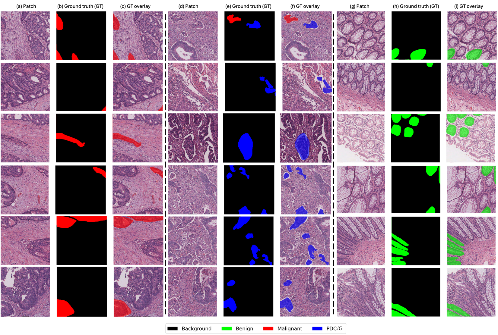
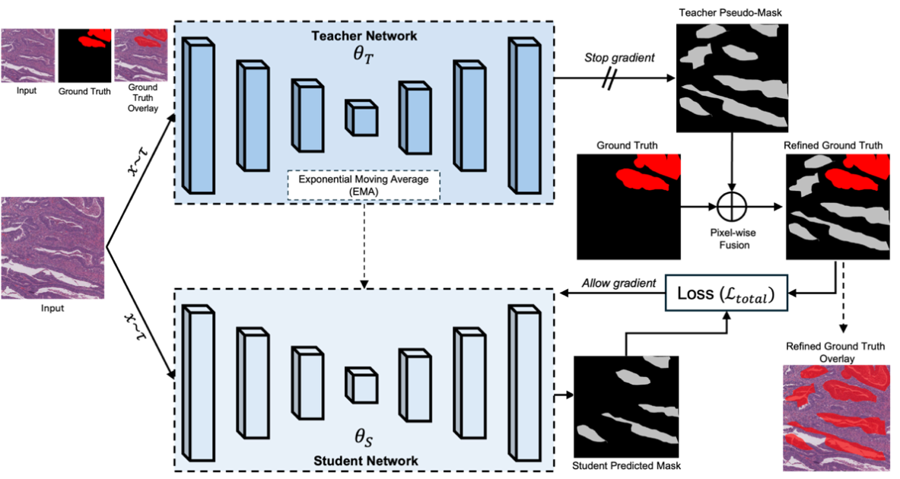
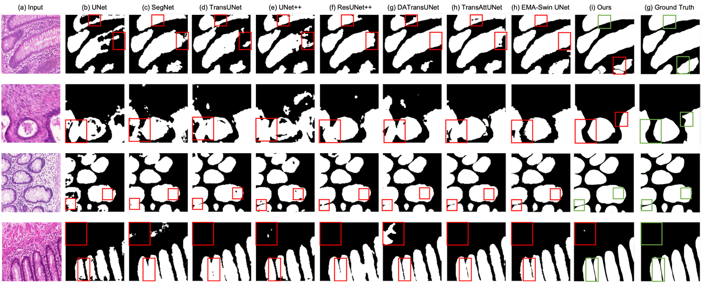
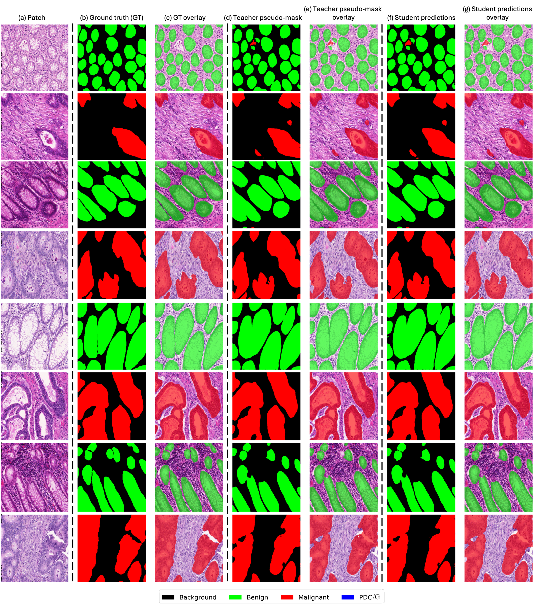
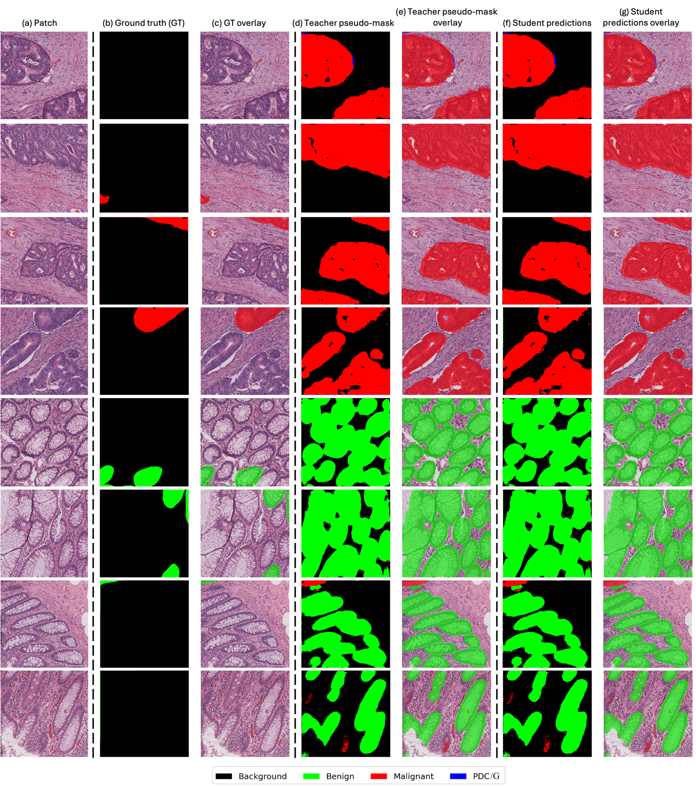
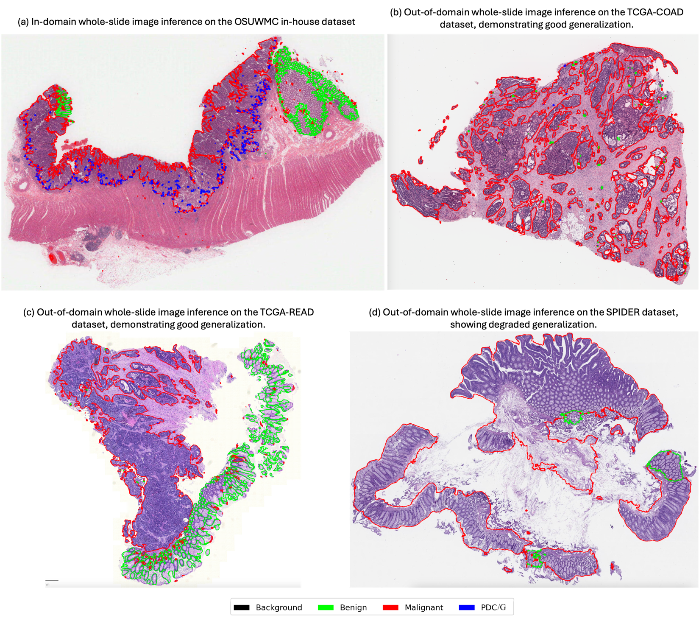

# Weakly Supervised Teacher–Student Framework with Progressive Pseudo-Mask Refinement for Gland Segmentation

[](https://www.python.org/downloads/)
[](https://pytorch.org/)
[](https://developer.nvidia.com/cuda-toolkit)
[](LICENSE)

> **Official PyTorch implementation** of *"Weakly Supervised Teacher–Student Framework with Progressive Pseudo-Mask Refinement for Gland Segmentation"*
>
> **Authors:** Hikmat Khan*, Wei Chen, Muhammad Khalid Khan Niazi
> **Affiliation:** Department of Pathology, College of Medicine, The Ohio State University Wexner Medical Center, Columbus, OH, USA
> **Funding:** R01 CA276301 (PIs: Niazi, Chen) — National Cancer Institute

---

## 📋 Overview

Colorectal cancer (CRC) histopathological grading depends on accurate segmentation of glandular structures, but fully supervised deep-learning methods require dense pixel-level annotations that are labor-intensive and impractical at clinical scale. Existing class activation map (CAM)–based weakly supervised semantic segmentation (WSSS) approaches typically produce incomplete, low-quality pseudo-masks that overemphasize the most discriminative regions and fail to provide reliable supervision for unannotated glandular structures.

We propose a **weakly supervised teacher–student framework** that leverages **sparse pathologist annotations** together with an **Exponential Moving Average (EMA)–stabilized teacher network** to generate progressively refined pseudo-masks. The framework integrates:

- **Confidence-based filtering** of teacher predictions
- **Adaptive pixel-wise fusion** of sparse ground truth with teacher pseudo-labels
- **Curriculum-guided refinement** that progressively expands supervision from high-confidence regions to ambiguous boundaries

This enables the student network to discover and accurately segment unannotated glandular regions, reducing annotation burden by approximately **60×** while maintaining performance competitive with fully supervised methods.

### 🎯 Key Contributions

1. **Sparse-annotation-aware pseudo-label fusion** — preserves pathologist-provided sparse annotations while leveraging EMA-stabilized teacher predictions to supervise unlabeled regions.
2. **Curriculum-driven pseudo-mask refinement** — combines cosine-decayed confidence thresholding with dynamic loss weighting to expand supervision from high-confidence gland regions to ambiguous boundaries.
3. **Comprehensive multi-cohort evaluation** — validated on (i) an institutional sparse-label dataset, (ii) the public GlaS benchmark, and (iii) three external cohorts (TCGA-COAD, TCGA-READ, SPIDER) to assess cross-domain generalization.

### 📊 Performance Highlights

| Setting | mIoU (%) | mDice (%) |
|---|---|---|
| GlaS (weakly supervised, ours) | **80.10 ± 1.52** | **89.10 ± 2.10** |
| GlaS — best fully supervised baseline (EWASwin UNet) | 81.5 | 89.4 |
| GlaS — best weakly supervised baseline (MAA) | 81.99 ± 2.26 | 90.10 ± 3.31 |

Our framework achieves **lower variance** than MAA (±1.52 vs ±2.26 mIoU), a critical prerequisite for clinical deployment.

---

## 🖼️ The Annotation Challenge

The motivation for this work is illustrated by the in-house **OSUWMC dataset**, where pathologists provide only sparse pixel-level annotations. Most patches contain both annotated and unannotated glands, making accurate segmentation under weak supervision a non-trivial problem.



> **Figure 1.** Representative samples from the in-house OSUWMC dataset, illustrating sparse annotations for three key gland classes — benign glands, malignant glands, and poorly differentiated clusters/glands (PDC/G). For each class, columns show: (a/d/g) original H&E patch, (b/e/h) sparse ground truth from two pathologists, (c/f/i) annotation overlay. Color coding: red = malignant, green = benign, blue = PDC/G, black = stroma.

---

## 🔬 Method

### Framework Overview



> **Figure 2.** Schematic overview of the proposed teacher–student self-training framework. The teacher network (θ_T), stabilized by EMA, generates initial pseudo-masks. These are refined via confidence-based filtering and adaptively fused with sparse ground-truth annotations to produce high-quality supervision for the student network (θ_S). The student's parameters are then used to update the teacher via EMA. This iterative process, governed by a total loss (L_total), enables progressive discovery of unannotated glandular structures.

### Problem Formulation

Given an input image **x ∈ ℝ^(H×W×3)** and pixel-level labels **y ∈ {0, 1, …, C}^(H×W)** with **C = 4** classes (background stroma, benign glands, malignant glands, PDC/G), we learn a function **f_θ(x)** producing per-pixel class probabilities **p_θ(x) ∈ [0, 1]^(H×W×C)**. The framework uses an **nnU-Net** backbone for both the student (θ_S) and teacher (θ_T) networks.

### Two-Phase Training Protocol

#### Phase 1 — Supervised Warm-Up (≈20–25% of total epochs)

The teacher remains inactive while the student is trained on the available sparse annotations using a combined Dice + categorical cross-entropy loss:

$$\mathcal{L}_{\text{supervised}} = \mathcal{L}_{\text{Dice}} + \mathcal{L}_{\text{CCE}}$$

This stage builds robust representations and provides a stable initialization for the teacher.

#### Phase 2 — Teacher–Student Co-Training

The teacher is initialized from the student (θ_T ← θ_S) and updated via EMA:

$$\theta_T \leftarrow \beta\, \theta_T + (1 - \beta)\, \theta_S, \qquad \beta = 0.999$$

The student is then optimized against a hybrid loss:

$$\mathcal{L}_{\text{total}} = \alpha_t\, \mathcal{L}_{\text{supervised}} + (1 - \alpha_t)\, \mathcal{L}_{\text{consistency}}$$

where **α_t** follows a cosine schedule from **0.9 → 0.01**, gradually shifting reliance from sparse GT to teacher-guided consistency.

### Progressive Pseudo-Mask Refinement

**1. Confidence-based filtering (curriculum learning).** A binary confidence mask retains only teacher predictions whose softmax probability exceeds a cosine-decayed threshold τ_confidence(t) decreasing from **0.95 → 0.25** over training:

$$m(x) = \mathbb{1}\big[\max \sigma(f_{\theta_T}(x)) > \tau_{\text{confidence}}(t)\big]$$

**2. GT + teacher adaptive fusion.** Pathologist-annotated pixels are preserved exactly; unlabeled pixels receive teacher supervision:

$$\hat{m}(x) = \begin{cases} \text{GT}(x), & \text{if } \text{GT}(x) > 0 \\ m(x), & \text{otherwise} \end{cases}$$

**3. Consistency regularization** (logit-level MSE for stable training):

$$\mathcal{L}_{\text{consistency}} = \big\| \sigma(f_{\theta_S}(x)) - \hat{m}(x) \big\|^2$$

Together these mechanisms expand reliable supervision from high-confidence gland cores to ambiguous boundary regions while preventing confirmation bias from noisy early pseudo-labels.

---

## 📚 Datasets

### 1. OSUWMC In-House Dataset

| Property | Value |
|---|---|
| Source | The Ohio State University Wexner Medical Center |
| WSIs | 60 H&E-stained slides (independent patients, confirmed CRC) |
| Scanning | 40× magnification |
| Patch extraction | 512 × 512 px at 5× magnification |
| Total patches | 74,179 |
| Train / val / test | 63,191 / 5,460 / 5,528 |
| Annotators | 2 pathology residents, sparse pixel-level labels |
| Classes | Background stroma, benign glands, malignant glands, PDC/G |
| Approx. class prevalence | ~45% benign, ~35% malignant, ~15% stroma, ~5% PDC/G |

### 2. GlaS Benchmark (MICCAI 2015)

| Property | Value |
|---|---|
| Images | 165 H&E-stained images (16 colorectal sections) |
| Stage | T3–T4 colorectal adenocarcinoma |
| Resolution | 0.465 μm/pixel @ 20×; resized to 512 × 512 |
| Train | 85 images (37 benign, 48 malignant) → 70 train / 15 val |
| Test | 80 images (37 benign, 43 malignant) |

### 3. External Generalization Cohorts (Qualitative Only)

- **TCGA-COAD** — Colon adenocarcinoma
- **TCGA-READ** — Rectum adenocarcinoma
- **SPIDER** — Multi-organ pathology dataset

These cohorts do not provide pixel-level gland annotations, so evaluation is qualitative.

---

## 🚀 Quick Start

### Installation

```bash
# Clone repository
git clone https://github.com/hikmatkhan/gland-segmentation-teacher-student.git
cd gland-segmentation-teacher-student

# Create conda environment (Python 3.10)
conda create -n gland-seg python=3.10
conda activate gland-seg

# Install PyTorch 1.13.1 + CUDA 11.7
pip install torch==1.13.1 torchvision==0.14.1 --index-url https://download.pytorch.org/whl/cu117

# Install remaining dependencies
pip install -r requirements.txt
```

### Environment Setup

```bash
export GLAND_DATASET_BASE="/path/to/datasets"
export GLAND_OUTPUT_DIR="./outputs"
```

### Smoke Tests

```bash
# Quick functionality check
python tests/test_basic_demo.py

# Visualize the pseudo-mask refinement mechanism
python tests/demo_pseudo_gt_refinement.py

# Teacher–student integration test
python tests/test_teacher_student_integration.py
```

---

## 🎓 Training

### Reproduce Paper Results (GlaS)

```bash
python main.py train \
    --architecture teacher_student_unet \
    --dataset glas \
    --epochs 250 \
    --batch_size 16 \
    --learning_rate 0.01 \
    --weight_decay 0.001 \
    --optimizer adamw \
    --scheduler cosine_annealing \
    --min_lr 1e-5 \
    --grad_clip 1.0 \
    --warmup_epochs 50 \
    --ts_ema_decay 0.999 \
    --ts_pseudo_mask_filtering confidence \
    --ts_confidence_annealing cosine \
    --ts_confidence_max_threshold 0.95 \
    --ts_confidence_min_threshold 0.25 \
    --ts_gt_teacher_incorporate_enabled true \
    --ts_min_alpha 0.01 \
    --ts_max_alpha 0.9 \
    --early_stopping_patience 50 \
    --seed 42 \
    --output_dir ./outputs/glas_paper
```

### SLURM Training (HPC)

```bash
# Edit run_nnunet_training.sh for your cluster, then:
sbatch run_nnunet_training.sh
```

### Implementation Details (matching the paper)

| Setting | Value |
|---|---|
| Backbone | nnU-Net |
| Optimizer | AdamW |
| Initial learning rate | 0.01 |
| Weight decay | 0.001 |
| LR schedule | Cosine annealing → 1e-5 |
| Batch size | 16 |
| Input resolution | 512 × 512 |
| Max epochs | 250 |
| Early stopping | 50 epochs no improvement |
| Gradient clipping | Max norm 1.0 |
| EMA decay (β) | 0.999 |
| Confidence threshold τ | 0.95 → 0.25 (cosine) |
| Loss weight α | 0.9 → 0.01 (cosine) |
| Augmentation | Random rotation (0°/90°/180°/270°), horizontal flip (p=0.5), HSV jitter, Gaussian noise & blur, ImageNet normalization |
| Seeds | Five independent runs with different seeds; results reported as mean ± std |
| Hardware | NVIDIA A100 GPUs |

---

## 📊 Results

### Comparison with Weakly Supervised Methods (GlaS)

| Method | Year | mIoU (%) | mDice (%) |
|---|---|---|---|
| SEAM | 2020 | 71.36 ± 0.49 | 79.59 ± 4.88 |
| Adv-CAM | 2021 | 68.54 ± 3.36 | 81.33 ± 5.26 |
| SC-CAM | 2020 | 71.52 ± 3.50 | 83.40 ± 5.36 |
| ReCAM | 2022 | 56.31 ± 2.53 | — |
| AMR | 2022 | 72.83 ± 0.37 | — |
| MLPS | 2022 | 73.60 ± 0.16 | — |
| OEEM | 2022 | 76.48 ± 0.10 | 83.40 ± 5.36 |
| AME-CAM | 2023 | 74.09 ± 0.13 | — |
| HAMIL | 2023 | 77.37 ± 0.73 | — |
| CBFNet | 2024 | 76.30 ± 0.26 | — |
| MPFP | 2025 | 80.44 ± 0.05 | — |
| **MAA** | **2025** | **81.99 ± 2.26** | **90.10 ± 3.31** |
| **Ours** | **2025** | **80.10 ± 1.52** | **89.10 ± 2.10** |

Metrics reported as mean ± standard deviation over five independent training runs with different seeds. Our framework achieves competitive performance with **markedly superior training stability** — lower variance is a critical prerequisite for clinical translation.

### Comparison with Fully Supervised Methods (GlaS)

| Method | Year | mIoU (%) | mDice (%) |
|---|---|---|---|
| UNet | 2015 | 64.8 | 77.6 |
| SegNet | 2017 | 66.0 | 78.6 |
| MedT | 2021 | 69.6 | 81.0 |
| TransUNet | 2021 | 70.1 | 81.5 |
| Attention UNet | 2018 | 70.1 | 81.6 |
| UNet++ | 2018 | 70.2 | 81.9 |
| KiU-Net | 2020 | 72.8 | 83.3 |
| ResUNet++ | 2019 | 73.8 | 84.1 |
| DA-TransUNet | 2024 | 75.6 | 85.3 |
| TransAttUNet | 2023 | 77.7 | 86.7 |
| **EWASwin UNet** | **2025** | **81.5** | **89.4** |
| **Ours (Weakly Sup.)** | **2025** | **80.1** | **89.1** |

Our weakly supervised framework matches the leading fully supervised model (EWASwin UNet) within **~1.4% mIoU** while requiring substantially less annotation.

### Qualitative Comparison on GlaS



> **Figure 3.** Results on the GlaS dataset. Each row shows the input H&E patch, segmentation outputs from baseline methods, our prediction, and the dense ground-truth annotation. Red boxes highlight regions where baselines fail; green boxes mark regions where our framework correctly captures gland boundaries.



> **Figure 6.** Per-sample qualitative results on the GlaS test set. (a) input H&E image; (b) dense ground-truth mask; (c) GT overlay; (d) teacher pseudo-mask; (e) teacher overlay; (f) student final prediction; (g) student overlay. Color coding: red = malignant, green = benign, black = stroma.

### Qualitative Results on the OSUWMC Sparse-Label Cohort



> **Figure 4.** Qualitative segmentation on the in-house OSUWMC dataset. (a) input H&E; (b) sparse GT from two pathologists; (c) GT overlay; (d) teacher pseudo-mask; (e) teacher overlay; (f) student final prediction; (g) student overlay. Despite extremely sparse supervision, the stabilized teacher network guides the student to discover and segment **previously unannotated glands** while preserving expert annotations exactly. Color coding: red = malignant, green = benign, blue = PDC/G, black = stroma.

### Cross-Cohort Generalization (Whole-Slide Inference)



> **Figure 5.** Whole-slide–level qualitative assessment across (a) the in-house OSUWMC cohort, (b) TCGA-COAD, (c) TCGA-READ, and (d) SPIDER. The model trained on OSUWMC generalizes robustly to TCGA-COAD and TCGA-READ **without any additional fine-tuning**. Performance degrades on SPIDER due to severe domain shift (lower image quality, pronounced staining heterogeneity, higher morphological variability), highlighting the well-known challenge of cross-domain generalization in computational pathology and motivating future work on explicit domain adaptation.

---


## 📁 Project Structure

```
.
├── README.md                       # This file
├── LICENSE                         # MIT License
├── requirements.txt                # Python dependencies
├── main.py                         # CLI entry point
├── run_nnunet_training.sh          # SLURM training script
├── resume_nnunet_training.sh       # Resume from checkpoint
│
├── docs/                           # Documentation & figures
│   ├── figures/                    # Paper figures
│   ├── INSTALLATION.md
│   ├── TRAINING.md
│   ├── ARCHITECTURE.md
│   └── DATASETS.md
│
├── src/                            # Source code
│   ├── models/
│   │   ├── teacher_student_unet.py        # Main architecture ⭐
│   │   ├── teacher_student_loss.py        # Refinement mechanism ⭐
│   │   ├── baseline_unet.py
│   │   └── nnunet_integration.py
│   ├── training/
│   │   ├── teacher_student_trainer.py     # Training protocol ⭐
│   │   ├── trainer.py
│   │   └── dataset.py
│   └── evaluation/
│       ├── evaluator.py
│       └── post_training_evaluator.py
│
├── configs/
│   └── paths_config.py
│
├── tests/                          # Demos & integration tests
│   ├── demo_pseudo_gt_refinement.py
│   ├── test_teacher_student_integration.py
│   └── test_basic_demo.py
│
└── independent_eval/               # Standalone evaluation
    └── independent_evaluator.py
```

---

## ⚠️ Limitations

- The OSUWMC dataset lacks patient-level clinical metadata, precluding clinicopathologic correlation analyses.
- Results are reported as mean ± standard deviation; additional statistical measures (e.g., confidence intervals) are planned.
- Performance degrades on **SPIDER** under severe domain shift; addressing this will likely require explicit domain adaptation or stain normalization.
- Although annotation burden is dramatically reduced, the framework still relies on limited sparse expert annotations. Fully annotation-free segmentation remains an open direction.

---

## 🚀 Future Directions

- Extending the framework to other adenocarcinomas (prostate, breast, lung, endometrial).
- Incorporating explicit domain adaptation and stain normalization for cross-institutional deployment.
- Multi-task learning with prognosis prediction and tumor grading.
- Few-shot and fully annotation-free regimes.

---

## 📝 Citation

If you use this code or the framework in your research, please cite:

```bibtex
@article{khan2025weakly,
  title   = {Weakly Supervised Teacher--Student Framework with Progressive Pseudo-Mask Refinement for Gland Segmentation},
  author  = {Khan, Hikmat and Chen, Wei and Niazi, Muhammad Khalid Khan},
  journal = {Journal of Clinical and Translational Pathology},
  year    = {2025},
  note    = {Supported by R01 CA276301 from the National Cancer Institute}
}
```

---

## 🙏 Acknowledgments

### Funding

This project was supported by **R01 CA276301** (PIs: Niazi, Chen) from the National Cancer Institute, **The Ohio State University Comprehensive Cancer Center**, **Pelotonia Research Funds**, and the **Department of Pathology**. The content is solely the responsibility of the authors and does not necessarily represent the official views of the National Institutes of Health or the National Cancer Institute.

### Datasets

- **GlaS Dataset** — MICCAI 2015 Gland Segmentation Challenge
- **TCGA-COAD / TCGA-READ** — The Cancer Genome Atlas Program
- **SPIDER** — Multi-organ pathology dataset (Nechaev et al., 2025)

### Frameworks & Tools

- **nnU-Net** — Self-configuring framework for medical image segmentation
- **PyTorch** — Deep learning framework
- **Albumentations** — Image augmentation library

---

## 🏥 Ethical Approval

Use of the in-house OSUWMC dataset was approved by the Institutional Review Board of The Ohio State University Wexner Medical Center (**IRB No. 2018C0098**). Written informed consent was obtained from all patients or waived by the IRB due to the retrospective nature of the study. Public datasets (TCGA, SPIDER) were used in compliance with their respective data-usage agreements. All procedures complied with the ethical standards of the Declaration of Helsinki (as revised in 2024).

---

## 🔬 Data & Code Availability

### In-House Dataset

The OSUWMC dataset is available upon reasonable request — please contact the corresponding author at <Hikmat.Khan@osumc.edu> or <Hikmat.khan179@gmail.com>.

### Public Datasets

- **GlaS:** <https://warwick.ac.uk/fac/cross_fac/tia/data/glascontest>
- **TCGA-COAD / TCGA-READ:** <https://portal.gdc.cancer.gov/>
- **SPIDER:** <https://github.com/HistAI/SPIDER>

### Code

All training, inference, and evaluation code is provided in this repository under the **MIT License**.

---

## 📧 Contact

**Corresponding Author**

**Hikmat Khan**, PhD
Department of Pathology, College of Medicine
The Ohio State University Wexner Medical Center
Pelotonia Research Center, 2281 Kenny Road,
Columbus, OH 43210, USA

📧 <Hikmat.Khan@osumc.edu> or <Hikmat.khan179@gmail.com> 
🔗 ORCID: [0009-0008-2550-1991](https://orcid.org/0009-0008-2550-1991)

---

## ⚖️ License

This project is licensed under the MIT License — see the [LICENSE](LICENSE) file for details.

---

**Developed at The Ohio State University Wexner Medical Center**
*Advancing computational pathology through annotation-efficient deep learning.*
